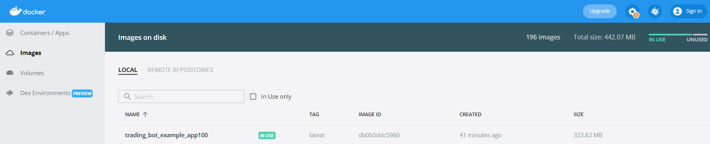

# Crypto Arbitrage Bot. Trades on Uniswap and Sushiswap. ETH network

## Index
+ [What is included in this repo?](https://github.com/6eer/arbitrage-bot-uniswap-sushiswap#what-is-included-in-this-repo)
+ [Installation](https://github.com/6eer/arbitrage-bot-uniswap-sushiswap#installation)
+ [Running the bot](https://github.com/6eer/arbitrage-bot-uniswap-sushiswap#running-the-bot)
+ [Deploying the contracts](https://github.com/6eer/arbitrage-bot-uniswap-sushiswap#deploying-the-contracts)
+ [Deploying NodeJS project to production](https://github.com/6eer/arbitrage-bot-uniswap-sushiswap#deploying-nodejs-project-to-production)
+ [Considerations for production](https://github.com/6eer/arbitrage-bot-uniswap-sushiswap#considerations-for-production)
+ [Useful resources](https://github.com/6eer/arbitrage-bot-uniswap-sushiswap#useful-resources)
+ [Notes](https://github.com/6eer/arbitrage-bot-uniswap-sushiswap#notes)

## What is included in this repo?
This repository contains bot that makes arbitrage between Uniswap V2 and Sushiswap.
The bot is written in TS that observes the prices changes on a pre user-defined liquidity pool at Uniswap V2 / Sushiswap and determine if there is a possibly to make a profit buying tokens cheaper at one exchange and selling them after for a bigger amount in the other, keeping the difference (profit).
For trades we don't use our own assets, we use FLASH loans from DyDx exchange.

This repository contains the following files:
1. Main NodeJS file - bot.js
2. helpers.js file that contains utility functions (get RESERVES, send messages to Telegram bot, get price differences and get TOKEN price in USD)
3. package.json file - file that contains description for NodeJS project and project dependencies.
4. .env file for keeping ENVIRONMENT variables in separate file
5. Dockerfile which is used to build docker app image
6. docker-compose.yml file which contains all docker apps for all tokens. This file is used to build and deploy apps

## Installation
For installing dependencies you should use the command:
```
npm run install
```

## Running the bot
The projects can be running by command:
```
node ./bot.js
```
This will run NodeJS application and start listening SWAP events on UniSwap and SushiSwap and if there is a price difference in liquidity pools, it executes trades using DyDx flash loans.
Basically the project does the following:
1. Connects to Ethereum network node (I use Alchemy).
2. Start listening SWAP events for pair ETH/TOKEN both on UniSwap and SushiSwap DEXes.
3. If SWAP event happens, it checks RESERVES for these pairs in liquidity pools and possibility to trade arbitrage. Also it checks which direction we need to trade: UniSwap->SuhsiSwap or SushiSwap->UniSwap.
4. Checking profit for the trade. If profit > 0, we execute trade using Flash Loan DyDx Solidity Smart Contract.
5. For trades we use this UniSwap/SushiSwap API command:
```
sRouter.swapExactTokensForTokens(
    _amountIn,
    _amountOut,
    _path,
    address(this),
    (block.timestamp + 1200)
);
```

6. Also project sends messages to Telegram Bot in situations when trade is possible and after executing successful trade.

## Deploying the contracts
For deploying the contracts I use Remix IDE. You need to connect the Web3 Metamask Wallet and use the option 'Injected Web3'.

## Deploying NodeJS project to production
Project can be deployed to Digital Ocean Cloud Provider. You need to install Docker Desktop on this Cloud.

You can see docker-compose.yml file and Dockerfile in the root folder.

Dockerfile is used for building the docker image using 'node:16.18.0-slim' package.

In docker-compose.yml you will see the following blocks:
```
  app1:
    build: .
    volumes:
      - .:/usr/app/
      - /usr/app/node_modules
    ports:
      - 301:3000
    environment:
      - TOKEN_NAME=UNI
      - TOKEN_CONTRACT=0x1f9840a85d5af5bf1d1762f925bdaddc4201f984
    command: node ./bot.js
    restart: always
```

We need to use different ports for different apps. Also you can see that we pass TOKEN_NAME and TOKEN_CONTRACT to environment variables.
For every app we use different tokens. For example: if we have UNI as TOKEN_NAME, this token will be used with ETH as pair to trade.

The file docker-compose.yml was generated using self-written Java application which parses tokens for ETH network and checks if Uniswap and Sushiswap have liquidity for pairs ETH/TOKEN.

The project can be deployed by command:
```
docker-compose up -d
```
This will start building docker images and after building, starting apps.

## Considerations for production
For production we need to choose Digital Ocean machine.


There are several options:
1. General Purpose
2. CPU-Optimized
3. Memory-Optimized
4. Storage-Optimized

I assume 'Memory-Optimized' is preferable, because docker NodeJS applications consumer a lot of memory.

To build docker images for apps you can use different NodeJS build images. Slim versions reduce the image size.


But also there is an approach of cleaning up dependencies, which is really reduces size of docker image (this approach is not used in this project, because it was failing during build, maybe different build image should be used).



Also NodeJs application can be rewritten using Binance Smart Chain network (BSC) and DEXes: PancakeSwap and UniSwap.

## Useful resources

[Solidity docs](https://docs.soliditylang.org/en/v0.8.5/)

[Deploying the contracts using Remix IDE](https://remix-ide.readthedocs.io/en/latest/create_deploy.html)

[Uniswap Swap Router SDK](https://docs.uniswap.org/contracts/v2/reference/smart-contracts/router-02)

[Digital Ocean](https://www.digitalocean.com/)

## Notes
Flash Loan DyDx Solidity Contract was not committed to repository to avoid using this project for arbitrage purposes by other GitHub users.